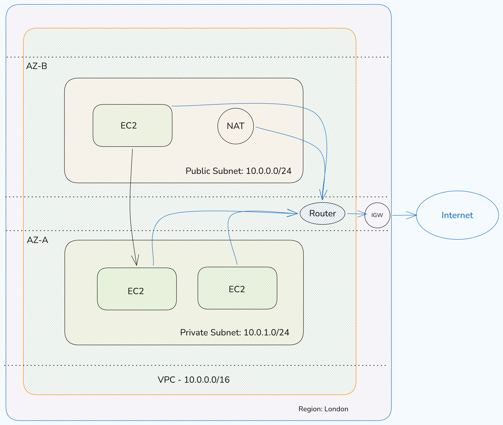
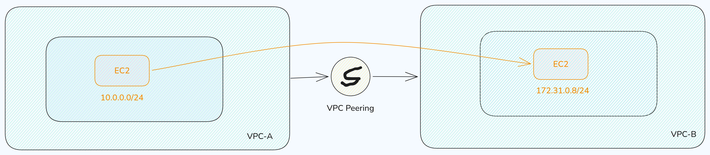
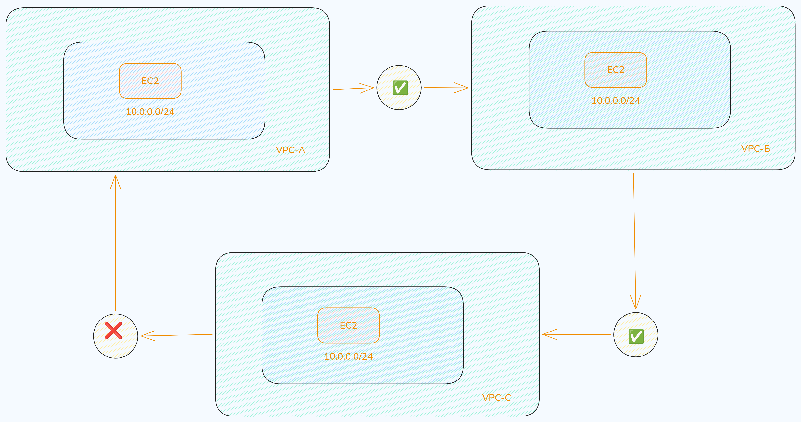

# AWS VPC (Virtual Private Cloud)

### What is VPS?
A VPC (**Virtual Private Cloud**) is a logically isolated network in AWS where you can launch and manage your resources (like EC2 instances, databases etc.).



- VPC is a virtual network or datacenter inside AWS for one client
- It is a logical isolated from other cirtual network in the AWS Cloud
- A VPC is confined to an AWS region and does not extend between regions

Think of it as your **private data center inside AWS**, where we can control:

- IP address range
- Subnets
- Routing
- Security

### Basic & Important Information About VPC

- Each VPC is region specific
- We can define a **CIDR block**(IP Range e.g. 10.0.0.0/16)
- By default, AWS creates a default VPC in every region
- We can create fully customizable networking environment
- Supports both IPv4 and IPv6
- In one region we can create maximum **5 VPCs** and under one VPC can create **200 Subnets**
- We can allocate maximum **5 elastic IPs**

### Components of VPC

A VPC consists of several building blocks

- Subnets
- Route Table
- Internet Gateway(IGW)
- NAT Gateway
- Network ACL (NACL)
- Elastic IPs 
- VPC Peering

### Types of VPC

1. Default VPC
    - Automatically created by AWS
    - Ready to use
    - Public subnets included
    - Has an IGW (Internet Gateway) by default

2. Custom VPC
    - Created by the AWS account owner
    - Full control over configuration
    - User needs to assign the CIDR 
    - Does not have the IGW by default

### What is a Subnet?

A Subnet is a smaller network inside a VPC. It divides our VPC into multiple sections for better:

- Organization
- Security
- Availability

_Example_

VPC: 10.0.0.0/16
Subnet: 10.0.1.0/24

> The allowed **CIDR block size is between /16 to /28**. The first four and the last IP address in a subnet are reserved and cannot be used

### Types of Subnet

1. Types of Subnet
    - Has the access to the internet
    - Connected via IGW (Internet Gateway)
    - Use for system like web servers, load balancers etc.

2. Private Subnet
    - No direct internet access
    - Does not connected with the IGW by default 
    - Used for databases, backend services etc. 

### Implied Router & Route Table

**Implied Router**

This is a logical router that connects different Availability Zones within a VPC. It works as the central routing system and also connects the VPC to the Internet Gateway (IGW). 

- Automatically created by AWS
- Connects all subnets within a VPC
- No manual configuration required

**Route Table**

A route table in a VPC (Virtual Private Cloud) in Amazon Web Services is a set of rules that control how network traffic moves inside your VPC. A route table is a collection of rules that directs network traffic between subnets, the internet and other resources in a VPC.

In simple terms, it decides where your traffic goes.

- Defines how traffic flows in our VPC
- Contains rules
- Each subnet must be associated with only one route table at any given time
- We can associate multiple subnets with the same route table 

### Internet Gateway (IGW)

An **Internet Gateway (IGW)** in a VPC in AWS is a component that allows your VPC to connect to the internet. It acts like a **bridge between your VPC and the internet**.

- Enables communication between VPC and the internet
- Attached to a VPC by default 
- Required for public subnets
- It performs NAT between our private and public IPv4 address 
- It supports both IPv4 and IPv6 

### NAT Gateway

A **NAT Gateway** in a VPC in AWS allows private resources to access the internet without exposing them directly.

- Allows private subnet resources to access the internet
- Prevents inbound connections from the internet
- We must also specify an **Elastic IP** address to associate with NAT Gateway when we create it

```bash
Example

Private EC2 --> Download Updates --> via NAT Gateway
```

### Security Groups

A **Security Group** in AWS is a virtual firewall that controls traffic for your resources (like EC2 instances). It decides what traffic is allowed in and out of our instance.

- Acts as a virtual firewall for instances
- Works at instance level
- Only allows rules (no deny rules, everything else is blocked by default)
- Stateful (remembers connections)

**Inbound rules**

These control incoming traffic to our resource (like an EC2 instance). They decide who can access our server and on which port.

_Example_

- Allow port 80 → users can open our website
- Allow port 22 → we can SSH into our server

**Outbound rules**

These control outgoing traffic from our resource. They decide where our server can send data.

_Example_

- Allow all traffic → server can access internet (APIs, updates)
- Restrict traffic → server can only connect to specific services

In short we can say that:

- Inbound = incoming traffic
- Outbound = outgoing traffic

### Network ACL (NACL)

A **Network ACL (NACL)** in AWS is a security layer that controls traffic at the subnet level in a VPC.

- It is a dunction that performs on the Implied router
- Firewall at the subnet level
- Supports Allow & Deny rules
- Rules are checked in order (by rule number)
- Highest number that we can use for a rule is 32766

### Difference: Security Group vs NACL

| Feature    | Security Group      | NACL                     |
| ---------- | ------------------- | ------------------------ |
| Level      | Instance level      | Subnet level             |
| Type       | Stateful            | Stateless                |
| Rules      | Allow only          | Allow & Deny             |
| Evaluation | All rules evaluated | Rules processed in order |

### VPC Peering

**VPC Peering** in AWS is a way to connect two VPCs so they can communicate with each other privately. It creates a direct private connection between two VPCs using AWS network (no internet).



**Key points**

- Traffic stays secure and private
- No need for Internet Gateway or NAT Gateway
- Works across same or different regions

**Use Cases**
- Multi-region architecture
- Connecting services across VPCs

**Transitive VPC Peering**

Transitive VPC Peering refers to a situation where you might want traffic to flow through one VPC to reach another VPC via peering.

_Key points in Transitive VPC Peering_

- AWS does NOT allow transitive peering
- If VPC A is peered with VPC B and VPC B is peered with VPC C, A cannot reach C through B.
- Each VPC must have a direct peering connection to communicate



### Conclusion

AWS VPC is the foundation of cloud networking. Understanding VPC helps us:
- Design secure architectures
- Control traffic flow
- Build scalable applications

> VPC gives us full control over our cloud network, just like a real-world data center but more flexible and scalable.